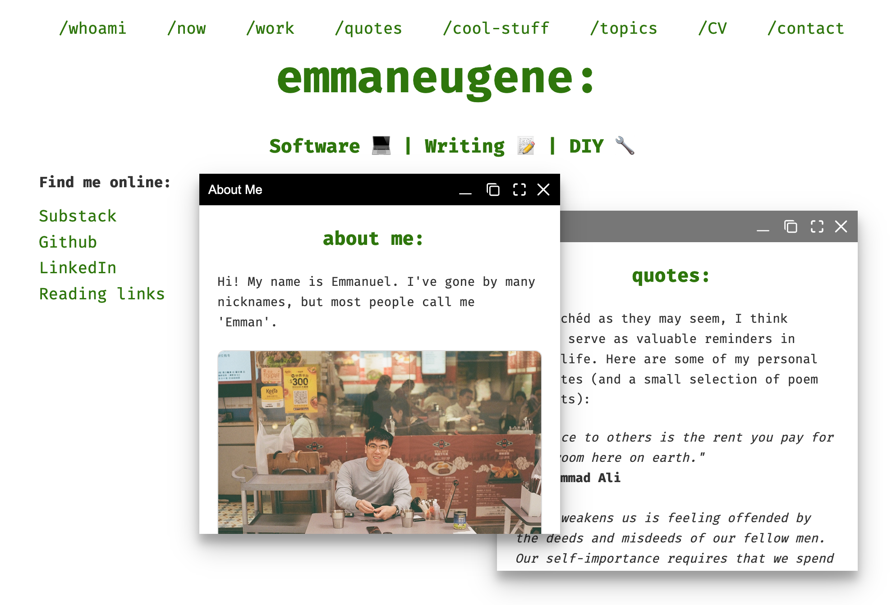

# Personal website

Files for my personal site, written with plain HTML/CSS/JS and the [WinBox](https://github.com/nextapps-de/winbox) library.

## Preview



## Local development

Clone this repo and serve it locally with [live-server](https://www.npmjs.com/package/live-server). Optionally, formatting can be done with [prettier](https://www.npmjs.com/package/prettier)

```bash

# Serve (defaults to port 8080, modify with --port=<PORT>)
live-server

# Format (applies to HTML, CSS and JS)
prettier --write .

```

Credit to [Brad Traversy](https://github.com/bradtraversy/terminal-landing-page) for the starter template!
